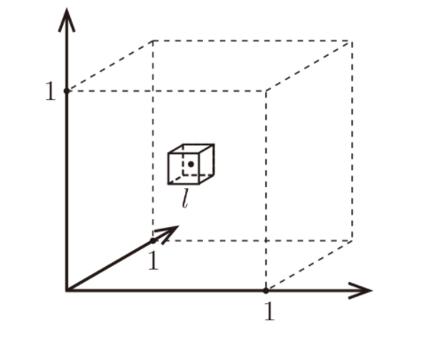

K-Nearest Neighbout is one of the simplest non-parametric classifier. A non-parametric classifier does not have a fixed number of parameters. Parametric classifiers like linear regression has fixed number of parameters. A KNN simply looks at its $'K'$ nearest neighbours and assigns the most common label among them. It is a memory based or instance based learning.

$$
p(y=c|x,D,K)=1/k * \sum_{i \in N_k{x,D}} I(y_i=c)
$$

Here, $N_k$ is the indices of the K-nearest points to x in dataset $D$. $I(.)$ is an indicator function. To find the nearest neighbout, kNN uses a distance metric. Euclidean distance is the most common distance metric used in KNN. 

kNN however does not work well with high dimensional data. Here comes the curse of dimensionality. 

Let us consider that $N$ number of data points, each of them $d$ dimensional with features normalized between $0,1$, are uniformly distributed in a unit cube space. Consider a test point $x$ that we want to label by growing a hypercube inside the cube in such a way that the hypercube contains the desired number of $k$ neighbours. Which is the main idea of kNN. Let us further assume that in our case, we are looking at $10$ nearest neighbours. So,

$$
x \in [0,1]^d, k=10
$$

Let us consider $l$ be the length of the cube to contain $k$ nearest points then, 

$$
l^d = k/n = (k/n)^{1/d}
$$

Let's plot a table assuming we have $n=1000$ samples: 

| d    	| l      	|
|------	|--------	|
| 2    	| 0.1    	|
| 10   	| 0.63   	|
| 100  	| 0.955  	|
| 1000 	| 0.9954 	|

  
So, for $1000$ dimensional datapoints, we will need to cover $99.54%$ of the datapoint space to contain only $10$ nearest neighours. So, not so near neighbours, ehh? :D 

<b>Reference papers:</b>
- [LIME](https://dl.acm.org/doi/pdf/10.1145/2939672.2939778?)
- [SHAP](https://proceedings.neurips.cc/paper/2017/file/8a20a8621978632d76c43dfd28b67767-Paper.pdf)
