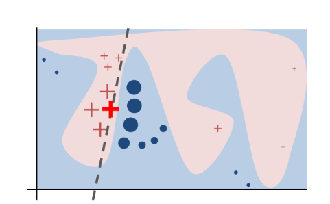

In our previous blog, we delved into the intricate world of explainability in machine learning, exploring various terms and techniques. Today, let's shine a spotlight on two of the most influential players in the field of Explainable Artificial Intelligence (XAI): Local Interpretable Model-agnostic Explanations, fondly known as LIME and  SHapley Additive exPlanations, aka SHAP.

**What is LIME?**

LIME stands tall as a model-agnostic explanation method designed to explain the predictions of black box machine learning models. The genius of LIME lies in its ability to locally approximate a black box model with an interpretable surrogate model. This surrogate model, often simpler and more understandable like a linear model or decision tree, mimics the behavior of the complex black box model.

**High-Level Dance** 

Imagine you have a black box model, perhaps a deep learning model trained for classification. LIME steps in when you want to explain the prediction it makes for a given test input. Here's how LIME does its magic:

1. **Generate Variations:** For instance, if your model deals with text classification, LIME crafts new text samples by randomly omitting words from the original text. For image-related tasks, LIME creates variations by manipulating "superpixels," interconnected pixels with similar colors and turning superpixels off or on to create new images.

2. **Feed to the Black Box:** These perturbed samples are then fed into the black box model, and predictions are obtained.

3. **Build the Surrogate:** Armed with the new dataset and labels generated around the test input, LIME trains an interpretable surrogate model. This model acts as a local approximation of the black box model. Linear models or decision trees are commonly used here.

4. **Interpretability Unveiled:** The weights of the surrogate model provide feature importance or attribution, explaining prediction of the black box.

The above figure clearly explains the intuition for LIME. In the figure, highly non-linear black mbox model decision function which is unknown to the LIME is represented by blue/pink background. We cannot explain this model with a linear approximation. However, if we want to explain a test instance (bold red cross), we can generate nearby samples around this sample, get predictions using the black-box model, weight them by the distance from the test input being explained, and fit a linear model. 

**Limitations of LIME:**

While LIME flexes its muscles across tabular, text, and image datasets, it comes with its set of limitations. Explanations generated by LIME exhibit stability in tabular datasets but are unstable with explaining text or images. Additionally, users need to pre-define the complexity of the surrogate model, specifying the desired number of features for their interpretable model.

**What is SHAP?**

SHAP, standing for SHapley Additive exPlanations, is a method for explaning machine learning models, built on the mathematical concept of Shapley values from cooperative game theory.

<b>What is a Shapeley value?</b>Shapley value is the average marginal contribution of a feature across all possible coalitions or combinations of features used for making a prediction. The interpretation of a Shapley value for feature $$j$$ is "what value did the $$j$$-th feature contributed to the prediction of the particular instance compared to the average prediction for the dataset". It is the average contribution of a feature value to the classifier prediction in different coalitions of features and not the difference in prediction when a feature is removed from the model.

<b>Reference papers:</b>
- [LIME](https://dl.acm.org/doi/pdf/10.1145/2939672.2939778?)
