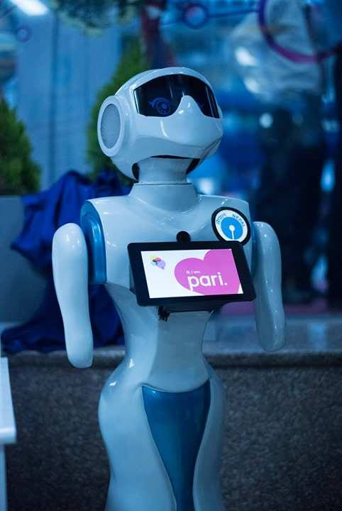
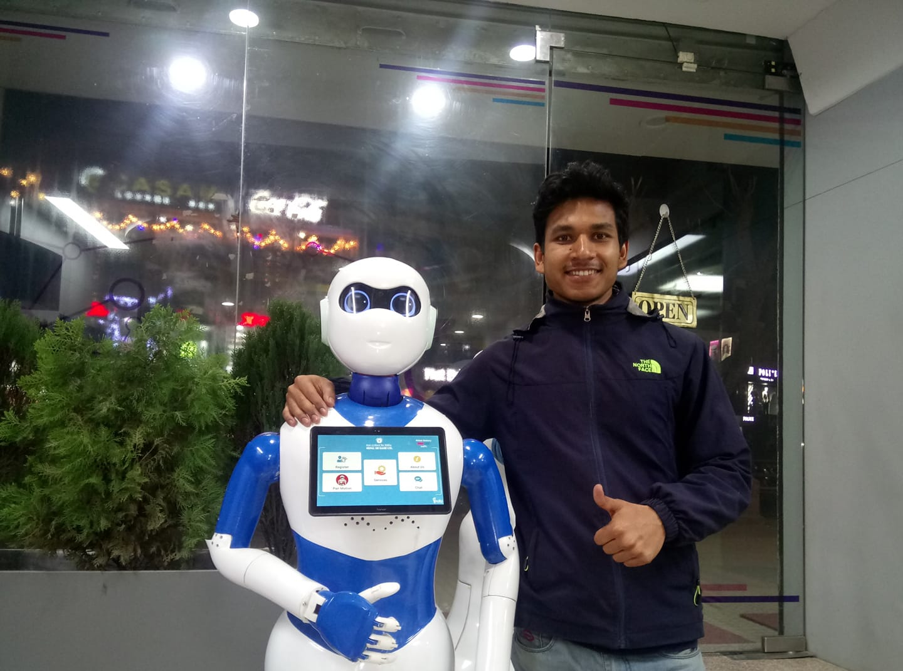
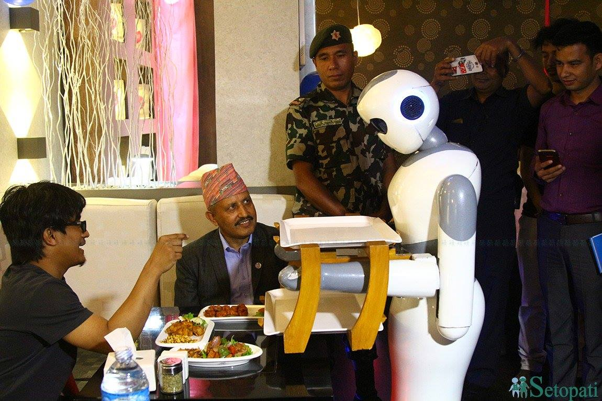
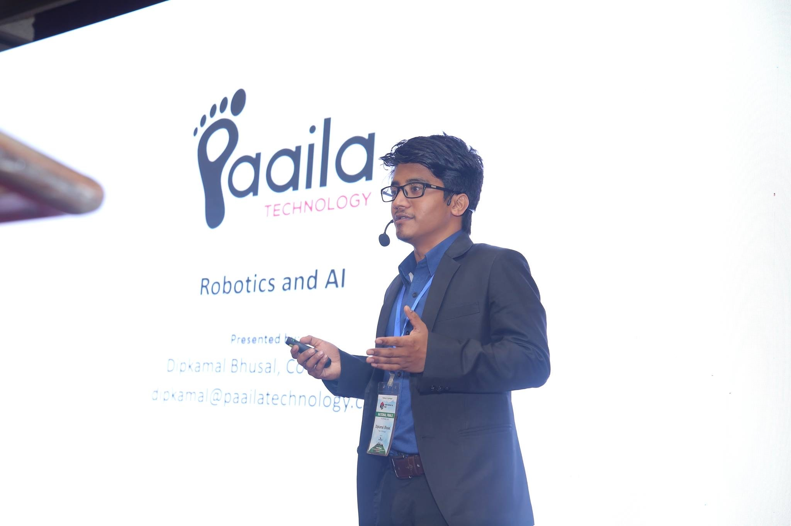
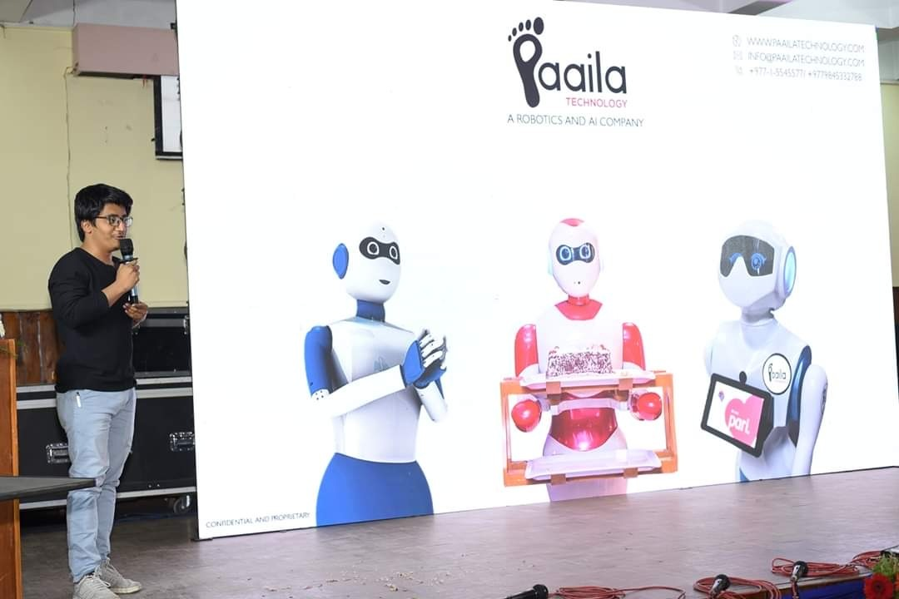

Upon graduating as an engineer in Nepal from Pulchowk Campus (still regarded as the most prestigious campus for engineering), two distinct life paths emerge: a) securing a government job, or b) pursuing higher studies in the USA. In 2016, the 069BEX batch of electronics and communication engineering, found themselves grappling with this very dilemma. Uncertain about our future and feeling that our undergraduate life had concluded too soon, my peers—Rabin, Sagar, Niraj, Wasim—and I contemplated our next steps without reaching any concrete decisions. Meanwhile, Niraj and Wasim completed their GRE examinations and were poised to apply to universities in the USA. 

 We were out of our university hostel, probably the cheapest place to live in the whole Kathmandu valley, costing only 3 dollars per month. We needed to look for jobs immediately since we needed a place to stay. We strarted looking for (non-government) jobs in Kathmandu. Personally, I was not inclined to work for someone else. While I didn't oppose a 10-5 job, I believed I could achieve more if I did something on my own. As a student, I had attempted to start a company a couple of times by developing Android applications, but none had materialized. Fortunately, my four friends had reached a similar conclusion after few weeks of hustle in the city.

One afternoon, while sipping tea at a stall outside the campus, we made a decisive choice to establish our startup. We named it Paaila, which translates to 'Step' in Nepali. Thus, Paaila Technology was born.

At the outset, our team was uncertain about our overarching goal. Despite having a core background in robotics, there were no specific projects in the pipeline. Consequently, we opted for software design jobs with other companies to sustain ourselves. Our work encompassed image stitching, website development, and custom software design. Additionally, we ventured into hardware with the creation and installation of an embedded system—an auto water filler—in houses across Kathmandu.

The pivotal moment for our journey into robotics and AI arose when Nepal SBI Bank approached us to develop a service robot for their digital bank. This marked the inception of our foray into this exciting field. Rising to the challenge, we conceptualized and manufactured Pari, heralded as the first service robot in Nepal.

Pari could only sense people's presence and greet them with pre-recorded sounds. Despite lacking state-of-the-art functionality, it became a massive hit in Nepal, propelled by media hype. This triumph laid the foundation for our continued journey in robotics.

Building on this momentum, the same bank approached us to develop an advanced service robot, Pari 2.0. Seizing the opportunity, we expanded our team by hiring more skilled individuals and dedicated ourselves to the task. A year later, we successfully released an advanced robot that surpassed its predecessor in terms of functionality and capabilities.

The upgraded robot, Pari 2.0, showcased significant advancements—it could navigate within the bank, engage in conversations with people, and even recognize customers' faces. Concurrently, we delved into the development of waiter robots, unveiling Ginger around the same period. In a simultaneous venture, we inaugurated Naulo, a fully automatic robotics restaurant situated at the heart of Kathmandu.

By 2018, our team had expanded from 7 to 20 members. In addition to our focus on robotics, we were engaged in various projects, including chatbots, speech recognition, and synthesis.

Initially, I began as a team member in research and development. However, as the company grew, I assumed the role of Managing Director. This transition prompted me to represent our company in national and international startup competitions, where I forged partnerships and collaborations. Our work at Naulo garnered attention from prominent news agencies such as AFP News, Al-Jazeera, and Bloomberg. We received several accolades, including Startup of the Year (2017), Most Creative Business (2018), and the National ICT Innovation Award (2019). I had the opportunity to participate in the global finals of the Creative Business Cup in Copenhagen, where I connected with international startups and mentors. 

Despite our efforts to propel the company forward, we encountered numerous roadblocks. One significant challenge arose when our co-founders pursued higher studies in the United States, leaving only two of us in the company by 2020. Internal and financial issues further compounded our difficulties. However, the full account of these challenges will have to wait for another day.

By 2021, I had also made the decision to further my studies. Consequently, I left the company, commenced teaching at a college, and embarked on preparing for my PhD application. In August 2021, I arrived in the USA to pursue my academic goals.

My journey with Paaila was transformative. As a young graduate, I jumped into a journey that taught me life-long skills and desires for innovation, perseverace and continous learning. As a team member immersed in research and development, I witnessed the evolution of a small robotics startup into a a company with regional recognition. Stepping into the role of Managing Director, I navigated the challenges of managing the company activities and representing the company in national and international arenas, forging connections with diverse collaborators and mentors.

However, the journey was not without its share of obstacles. Co-founder departures, internal challenges, and financial hurdles tested our resilience. There were few things we could have done differently that would have changed the course of our company. But I do not regret or lament on my time spent at Paaila. Someday, I will write another chapter on lessons learnt from this unforgettable experience.