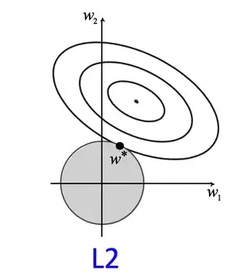
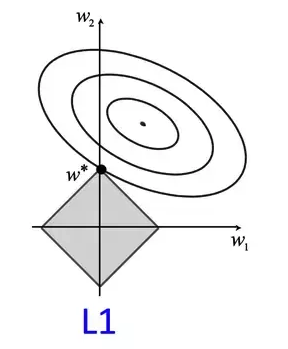

Regularization can be defined as the process of modifying a learning algorithm to reduce the generalization error i.e. error on unseen test data. Regularization is added to an algorithm so that the model does not overfit the training data. The goal is to increase the model bias and reduce variance. This will always hurt the training error. However, we compromise on the training error to get a better generalization on unseen test data.

Above figure shows a model in which training loss gradually decreases, but validation loss eventually goes up. In other words, this generalization curve shows that the model is overfitting to the data in the training set. So, instead of minimizing just the loss of the model, with minimize(Loss(Data|Model_Parameters)), we will now minimize loss+complexity i.e. minimize(Loss(Data|Model)) + complexity (model).

Our training optimization algorithm which only consisted of loss term, is now a function of two terms: the (old) loss term, which measures how well the model fits the data, and the regularization term, which measures model complexity. Model complexity can be viewed as a function of weights of all the features in the model or the total number of non-zero weight features in the model. There are two methods to quantify these views.

<b>Regularization by introducing a parameter norm penalty to model objective:</b>
Let us consider J be the objective function of a model (loss),  $\theta$ be its parameters, X and y be the input-output pair,  $\Omega (\theta)$  be the parameter norm introduced as penalty then our modified regularized objective function is given by: 


$$
J'(\theta; X,y)=J(\theta; X,y)+ \alpha \Omega (\theta)
$$


where , $\alpha$ is the regularization parameter [0,$\infty$) and controls the strength of regularization. So, now when we minimize our regularized objective function, both original objective function and the regularization norm is minimized. 

**L2 regularization**

In L2  regularization, model complexity can be viewed as a function of the weights of all the features in the model. Hence, the model with high absoluate value of feature weights is more complex than model with low absolute value of feature weights. So, the goal of this regularization is to minimize the absolute values of the feature weights. In L1 regularization (which we will discuss shortly), the complexity is viewed as a function of the total number of features with nonzero weights. Hence, the goal is to drive weights to zero and obtain a sparse parameter representation. 

L2 regularization is also known as ridge regression or Tikhonov regularization or weight decay. It uses the following norm:


$$
\Omega (\theta)=(1/2)*||w||_2^2 
$$


Which is the sum of square of the weights. The weight with high values have huge effect on model complexity and wieght with close to zero value have little effect. Hence, the goal of this regularization is to drive the weights of the network closer to zero. We will see how. The regularized loss function is now,


$$
J’(\theta; X,y)=J(\theta; X,y)+\alpha \Omega (\theta)
=J(\theta; X,y)+\alpha/2 \Omega * ||w||_2^2
$$


The gradient of this function with respect to weight, w is given by, 


$$
\nabla_wJ’=\alpha w+\nabla_w[J(\theta; X,y)]
$$


Then at each step, weight will be updated as: 


$$
w=w-\epsilon*[\alpha w+\nabla_w[J(\theta; X,y)]]
$$



$$
w=w(1-\epsilon * \alpha)-\epsilon*\nabla_wJ(\theta;X,y)
$$


So, at every iteration, the weight is shrinked by a constant factor. 

     
Consider a squared error loss function for a network with two dimensional weight vectors w; w1 and w2. The regularization term is constrained by the value of $\alpha$. So, $w1^2+w2^2$ can be expressed as a circle with radius $\alpha$. The squared loss is plotted as a contour plot where the center is the minimal loss without regularization. In a sense, the unregularized contour is overfitting the training data. 

So, the goal of solving the objective function with L2 regularization is finding a point where the loss of the contour is minimum and it lies within the circle of regularizer. In the figure, w* is the point. This is not equal to zero but close to it. If we increase the size of 𝝰, the size of the circle also increases and the model will be regularized more. 

<b>L1 regularization:</b>  L1 regularization views the complexity of a model as a function of the total number of features with nonzero weights. L1 regularization, also called Lasso regression, uses the following parameter norm as penalty.


$$
𝛀(Θ)=||w||_1
$$


Which is the sum of absolute values of the weight. The goal of this regularization is to drive the weights of the network to zero. Some parameters of the network will be zero hence, it produces a sparse solution also called sparse parametrization. Sparsity property of L1 regularization is often used as a feature selection mechanism. 

The regularized objective function is hence, 


$$
J’(\theta; X,y)=J(\theta; X,y)+\alpha \Omega (\theta)
=J(\theta; X,y)+\alpha/2 \Omega * ||w||_1^1
$$


Taking the grad of loss with respect to weights, 

$$
\label{eq:gradl1loss}
\nabla_wJ’=\alpha * sign(w)+\nabla_w[J(\theta; X,y)]
$$


Then at each step, weight will be updated as: 


$$
\label{eq:weightupdateL1}
w=w-\epsilon*[\alpha * sign(w)+\nabla_w[J(\theta; X,y)]]
$$



$$
w=w-\epsilon*\alpha * sign(w)-\nabla_w[J(\theta; X,y)]
$$


So, at every iteration, the weight is subracted by a factor. L1 regularizer also finds the point with minimum loss on the contour of the original loss that lies within the unit norm ball of an L1 norm which is a square (diamond) in this case because of 4 different lines we obtain from the regularizer equation. 
- Regularization with L2 is equivalent to MAP Bayesian inference with a Gaussian prior on weights. 
- L1 regularization is equivalent to prior isotropic Laplace distribution. 
- L2 regularization is strictly convex and is differentiable at all points. 
- L1 provides dense solutions using weight on all features. 
- L1 regularization is not strictly convex and non-differentiable at 0. 
- L1 produces sparse solutions.

<b>L0 regularization:</b> L0 regularization also introduces sparsity to the model but it introduces it more aggressively than L1. It does not shrink feature weights but remove features with constraint being the number of parameters less than some threshold count. L0 regularization is neither convex nor differentiable. It is computationally hard to optimize and likely intractable. Approximation of L0 regularization is topic of current research.

Other forms of regularization: 
- Dataset augmentation: Used widely with classification, The idea is that the classifier has to be invariant to a wide variety of transformations on input data hence new pairs of (X,y) are generated by applying transformation on inputs. 
- Noise injection: Adding noise to input, weights or output labels can also help in regularizing models. 
- Dropout: Idea is to train an ensemble of networks consisting of subnets formed from removing non output units of a network. Load a dataset, randomly apply a binary mask to all input and hidden units and train. Possible subnets are trained for a single step and parameters are shared to remaining subnets for convergence. Details in a different document later on. 
- Early stopping: Unobtrusive form of regularizer whereby the parameters of the model are stored every time error on validation set improves. If the model does not improve on the validation set, the training is stopped and the best parameter is recovered. 
- Sparse representation: Introduces penalty in the activation unit of a neural net such that it encourages the hidden units to be sparse. This is achieved similar to parameter regularization by introducing norm penalty on hidden representation, h. L1 penalty introduces sparse representation. 

<b>References</b>
- [Deep Learning Book](https://www.deeplearningbook.org/) 
- [Google Crash Course](https://developers.google.com/machine-learning/crash-course/regularization-for-simplicity/l2-regularization)