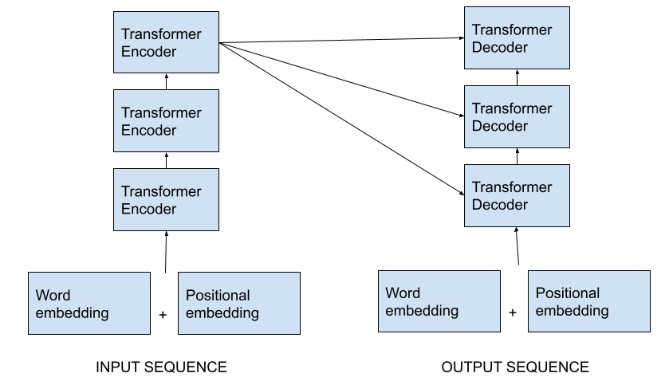
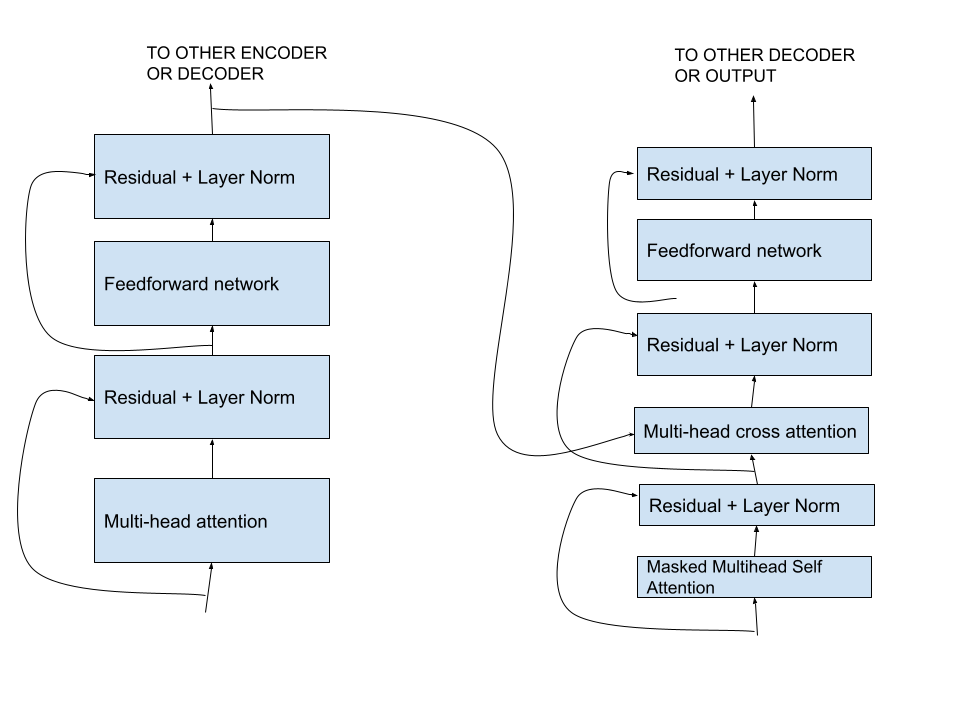

Vanilla RNNs encode word embedding in linear fashion following the principle that nearby words affect the meaning of a sentence. So, the number of steps required for distant word pair interaction grows linearly in O(sequence\_length). This introduces difficulty in learning long distance dependencies because of vanishing gradient problem over long sequence. Encoder of a vanilla RNN uses only one hidden state to capture all information of the input sequence. This causes an information bottleneck. We should extract as much information as possible from our input sequence for decoder part.

For example: in given picture, we want to translate an input sentence in English to Nepali target sentence "ma keta ho". For this type of translation task, one uses a sequence-to-sequence model, which consists of an encoder and a decoder, both of which are RNNs. In encoder, each word produces a hidden vector (called context vector) and output vector. The context vector is passed onto the next word (time). The final hidden state (context vector) is passd onto the decoder part, to translate the sentence. 

**Attention as a solution:** To improve long-distance dependencies by solving bottleneck and vanishing gradient problems, attention was proposed. It is a mechanism by which at each time step of decoder, we use direct connection with encoder that allows us to focus on a particular part of the sentence. By connection, it means that instead of just passing one context vector, all hidden states are passed to the decoder. Attention also provides some interpretability by learning where a decoder is focusing on. Another issue with recurrent models is lack of parallelizability that inhibits training on very large dataset. Attention eases parallelization. Transformer, the most popular NLP architecture, uses attention mechanism.

**Transformer:**
A transformer architecture also consists of an encoder-decoder part (eg. for a machine translation). The encoder part is a series of encoders stacked together. The same with decoder part. Each encoder consists of a self-attention block followed by a feed forward neural network. The decoder has both these and a encoder-decoder attention layer in between. 

**Self-attention and transformer:** In self attention, the first step is to create three vectors from the encoder's input vector (embedding of each word): query, key and value. *There is also cross-attention where the source of query, key and value differ.* For other encoders in the layer, query, key and value can are obtained from the output of a previous layer. If $x_1,x_2....x_T$ represent word vector where $T$ is the sequence length then we can assume $v_i=k_i=q_i=x_i$. 

There are three operations in self-attention mechanism: 

- Compute key-query affinity: $e_{ij}=q_i^Tk_j$
- Compute attention weights from affinities: $\alpha_{ij}=\frac{exp(e_{ij})}{\sum_j exp(_{ij})}$
- Compute output as weighted sum of values: $output = \sum_j \alpha_{ij} v_j$

So, self attention learns the representation from input word embedding with key-query-value vectors. But can it used as an NLP building block? For example: by stacking only self-attention blocks one after another like LSTM. It gets query, value and key from word embedding, performs self-attention operation on the query, value and key; receives new query, value and key and performs self attention again and so on. 

The answer is no.

There are three issues with default self-attention: 
- It has no idea of position or order of the words in the sequence. We cannot lose this information for NLP tasks. So, we need to encode the positional information with the keys, queries and values. Assume $p_i\in R^d$ be the vector representing sequence index where $$i\in{1,2...T}$$. We can encode positional information to key, query, value by adding them with positional vector. If $v'_i, k'_i, q'_i$ are old values, keys and queries, the new ones are $v_i=v'_i+p_i$, $k_i=k'_i+p_i$, $k_i=k'_i+p_i$.

    Transformer paper proposed concatenating sinusoidal function of varying period with the keys, queries and values. Position representation vector can also be learned as a learnable parameter. 
- There are no non-linearities in self-attention. To solve this, we simply add a feed forward net to process each output vector between self-attention blocks. 
- To use self-attention in decoder, we also need to mask out the attention vector so that the decoder cannot peek at the future values.

So, the building blocks of a self-attention model are: 

- Self-attention (*obviously*)
- Positional representation
- Non-linearity function 
- Masking

Transformer uses all these and more. 

**Additional functionalities in transformer:**

*How does transformer get k,q,v from a single word embedding?*

Let, $k_i=Kx_i, q_i=Qx_i, v_i=Vx_i;$ where $K,Q,V \in R^{dxd}$ are key matrix, query matrix and value matrix respectively.
    
These matrices learn different aspects of input embedding $x$ to capture meaningful relationship. Attention is computed as:  
$$
output=softmax (XQ(XK)^T) XV
$$ 

where, $X=[x_1, x_2,...x_T] \in R^{Txd}$ is input vector concatenated to a single vector.

*What is multi-head attention?*

Self-attention only looks at the input word embedding where the attention score is high. If we want to focus on more than one word in a sequence, we need something more. Multi-head attention helps with it. It is essentially a multiple attention mechanism with multiple Q,K,V matrices. Each attention head performs the same attention operation independently and output of all head is combined/concatenated. Each head gets to look at different word at a sequence and hence the value vector has more information.

*What is a cross-attention in decoder?*

 Self attention is when queries, key and values are obtained from same source. In cross attention decoder, keys and values come from encoder and query come from decoder.

*How difficult is to train this complex system?*

To help train transformer faster, Transformer uses residual connections, layer normalization and scaled dot product. With pre-trained transformer models, even small dataset can work well with Transformer models.

Transformer has great results and has surpassed all existing models especially in machine translation and text summarization.

<b>References</b>
- Attention Is All You Need, Vaswani et al. 2017
- [Illustrated Transformer](https://jalammar.github.io/illustrated-transformer/)
