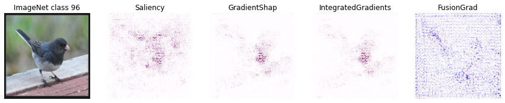

Deep learning, a powerful tool in computer vision, security, and healthcare, has revolutionized how machines make decisions. However, there's a catch—these models are often like black boxes. They make predictions, but it's hard for us to grasp how or why.

This is because deep learning models learn a complex non-linear mapping between the data and the target label, parameterized by millions of weights, making it impossible to understand how a model makes a certain prediction on test cases. In many cases, such models are proprietary; hence, access to how the models were designed is limited. This opaque nature poses challenges in assessing their fairness, bias, and reliability. Imagine relying on a system for critical decisions without knowing how it works—risky, right?

## The need for XAI

That's where eXplainable Artificial Intelligence (XAI) steps in. XAI aims to demystify the decision-making process of these sophisticated models. There are two main avenues in XAI research: interpretable machine learning and explainability.

### Interpretable Machine Learning: Designing Decipherable Models

**The Challenge:** Creating models that are naturally easy to understand.

Imagine models that, by their very nature, are interpretable. Decision trees and generalized additive models are examples of this category. They're like the simpler-human friendly models of the machine learning world – clear, concise, and understandable, through their weights and relationship between the features. But here's the catch – achieving high performance with interpretable models, especially with raw data like images, text and videos, is not easy.

### Unveiling the Black Box: Explainability Methods

**The Game Plan:** Unveiling how a model makes decision

Explainability methods aim to inspect a model's predictions after it's been trained (called, post-hoc methods in literature). You use such methods to see how a machine learning model made a specific decision on a given instance or a set of it.

 XAI methods can be classified into numerous categories based on the nature of explanations

    - Local vs. Global: Does the method explain model prediction on a single instance (local) 
    or explain the overall behavior of the model on a similar dataset (global)?
    - Model agnostic or model specific: Does the XAI method depend on specific 
    network architecture or work on all types of networks?
    -Types of explanation: Are explanations provided in terms of feature attribution, rules, 
    or counterfactual examples?

### Feature Attribution Methods

**What's the Deal?** Understanding the impact of individual features on predictions.

**How?** These methods assign scores to each feature, showing how much they influence a model's prediction. Think of it as giving credit where it's due.

Feature attribution methods interpret the impact of individual features (input variables) on the model's predictions. They assign a score to each feature that quantifies its importance in the model's prediction for the given example, and are widely used in research and industry. Given a trained model $$f(.)$$ and a test instance $$x\in R^d$$, a feature attribution-based explanation method $$\phi$$ returns a vector $$\phi(x) \in R^d$$ that provides the attribution vector (importance vector) of the feature. Other explanation methods include: rule-based explanations like ANCHOR that provides a decision rule on a combination of input features and are commonly used in tabular data. Counterfactual-based explanations (e.g., DeepAID) provide the closest instance of opposite prediction, such that their difference in feature provides explanations for the model prediction. A different explanation direction explains model prediction in terms of high-level human concepts. Instead of relying on input features, these methods, like TCAV, inspect if the model prediction was based on high-level human concepts. For example, to classify a zebra, were striped patterns used as the classification concept? We will come back to this topic later. 

Let's review some existing methods: 

#### LIME and LEMNA: Shining a Light Locally

**The Play:** Generate local explanations by shaking things up.

**How?** Imagine your model as a chef creating a secret recipe. LIME (Local Interpretable Model-agnostic Explanation) and LEMNA (Local Explanation Methods using Nonlinear Approximation) play the role of tasters, altering ingredients to understand the chef's thought process. Let me rephrase in technical terms: LIME and LEMNA generates local explanations for a model's predictions by perturbing input instances and observing the changes in the model's predictions. LIME creates an interpretable surrogate model through linear regression. It perturbs a test instance and generates new data samples to train the surrogate model. The weights of this model explain the predictions, with higher positive weights indicating the features that contribute the most. LEMNA uses a mixture regression model as surrogate model with a fused lasso penalty to account for feature dependencies. 
 
**Pitfalls:** LIME's assumptions on feature independence might lead to unreliable insights.  LIME's explanations are susceptible to manipulation. LEMNA may not perform as effectively as LIME in various applications. Both methods are suitable for tabular data and not prefered for raw datasets like images and text.

#### SHAP: Playing the Fairness Game

**The Play:** Distributing 'credit' fairly among features.

**How?** Picture your model as a team. SHAP values use game theory to ensure each player (feature) gets a fair share of the victory. It considers all possible feature combinations and calculate the average contribution of each feature to the model's output. Like LIME, SHAP generates new samples around a given instance, obtains predictions from the black box model, and trains an interpretable linear model on the dataset. However, unlike LIME, SHAP assigns weights to the new instances based on the weight a coalition would receive in the Shapley value estimation rather than their proximity to the original sample. 

**Pitfalls:** SHAP might be slower than LIME, but the robustness of SHAP shines through, making it consistent across different runs, but it can be vulnerable to data manipulations.

### Gradients: Navigating the Gradients

**The Play:** Unraveling the clues of feature influence.

**How?** Think of your model as a detective solving a case. Gradient methods measure how much the outcome changes as you tweak the input features. Lets talk about various gradient-based explanation method in details.

Gradient, also known as vanilla gradient, computes the gradient of the class score with respect to the input. This gradient quantifies how much the output predictions change when the input features change. This score serves as a measure of feature attribution. A simple enhancement to this method, called GradientXInput, involves multiplying the gradient by the input features. 

**Pitfalls:** Vanilla gradient method computes the gradient of the output with respect to the input feature, and in some cases, even if a neural network heavily relies on a particular feature, the gradient of the class score related to that feature may have small magnitudes. This issue can arise in deep neural networks (DNNs) due to saturation during the training process. 

To address this challenge, the integrated gradient (IG) method accumulates gradients along a linear path from a chosen baseline to the given test sample rather than relying on simple gradients. The selection of the baseline depends on the specific application. SmoothGrad and NoiseGrad propose improvements over gradient-based explanation methods. In SmoothGrad, for a given test sample, Gaussian noise is added to generate multiple samples (denoted as "n"), and their feature attributions are averaged to calculate the final attribution. On the other hand, NoiseGrad introduces noise to the model parameters, generates "n" models, and obtains an ensemble of explanations. GradientSHAP  combines concepts from SHAP, SmoothGrad, and integrated gradient. Instead of selecting a single baseline, it randomly picks a baseline from a distribution of baselines, often sourced from the training set. It computes attributions for each of these baselines and then averages the results.

**Pitfalls:** How do you select the baseline in IG? How do you find the best noise parameter in NoiseGrad and SmoothGrad? Gradient-based explanation methods can also assist attackers in better-estimating gradients for black-box attacks and may even enable them to reconstruct the underlying model. Worrisome, right?

#### DeepLIFT: Neurons know better

**The Play:** Scoring feature attributions through neuron activation.

**How?** Picture each neuron in your model as a musician in an orchestra. DeepLIFT listens to the symphony, comparing each musician's contribution to a reference activation. It's like tuning into the neural melody. Let me rephrase in technical terms: DeepLIFT calculates feature attribution scores by comparing the activation of each neuron to a designated "reference activation." The disparity between these two values contributes to the feature attribution score. Just like the integrated gradient method, the choice of reference activation is tailored to the specific problem under consideration, and this selection is crucial for obtaining accurate feature attribution. It's worth noting that this approach is essentially equivalent to layer-wise relevance propagation (LRP). In the case of DeepLiftSHAP, it extends the existing DeepLift algorithm to approximate SHAP values. 

**Pitfalls:** How do you get the baseline right? Luck?

#### Class Activation Maps: Zooming in

**The Play:**  Generating feature-importance maps for specific classes

**How?** Techniques like Grad-CAM involve backpropagating gradients to the convolutional layer, creating localization maps that highlight feature attribution. Perfect for Convolutional Neural Networks (CNNs).

**Pitfalls:** Specific to Convolutional Neural Networks (CNNs)

#### The Reality Check

Feature attribution based methods are not perfect. Many methods show class-invariant behavior (they produce similar feature attributions regardless of the predicted class). They are susceptible to adversarial manipulations. An adversary (attacker) can change the attribution without changing the model prediction. Additionally, some of these methods have been found to be non-robust to changes in model parameters. Even when random numbers are used to replace the parameters of a trained neural network, the feature attributions remain relatively unchanged. In addition, explanation methods can also exhibit instability in their results, questioning their reliabilility. 

### Concept-Based Explanations: Moving Beyond Pixels

**What's the Twist?** Moving beyond pixel-level features to high-level human concepts.

**Why?** Pixels might not mean much to us, but shapes, patterns, and objects do. Concept-based explanation methods bridge this gap.

Feature attribution-based methods explain model prediction in terms of input features, which are pixels in images. However, such features are not user-friendly. In images, a single pixel does not represent meaningful information as we are more concerned with a group of pixels in the form of shapes, objects, colors or patterns. Concept-based explanation methods were proposed to handle such limitations. This is a fairly new research topic with some progress in recent years. 

**What is a concept?:** A concept in a concept-based explanation is an abstraction for high-level features interpretable to humans, like colors, shapes, patterns, and objects. The goal of a concept-based method is to inspect whether the deep learning model used such high-level human ideas in making its classification decision.

**Some recent works** 

TCAV paper proposed a supervised approach to inspect whether a model used a concept for prediction and how important was it. To do so, it computes a vector called Concept Activation Vector (CAV), which is a representation of the defined concept in the activation space of a trained model.

To compute this vector for an image classifier, we first collect a dataset of images that represents the defined concept and a dataset of random counterexamples. For example: to obtain a vector for a concept called eyes, we collect lots of images of eyes and a set of random counter examples like images of nose, hair, shoes, etc. We pass these images to the neural network and collect activations from a hidden layer of the trained network. Then, we train a binary classifier that separates the activations vectors of concept-dataset and counter-examples. The concept activation vector is a vector orthogonal to this binary classifier. Once we have the concept vector, we can measure its importance or conceptual sensitivity on a given input by computing the derivative of the model prediction on the given input in the direction of the CAV. 

There are a few limitations to this method: TCAV performs badly on shallower neural networks since a shallow network might not generate activations that are linearly separable. TCAV also requires human annotation of datasets, which can be error-prone and an expensive task. 

ACE, Automated Concept-based Explanation (ACE), proposes an automated process to collect CAVs using segmentation and clustering. However, such segmentation and clustering-based approaches might lose important concepts in the image. 

ICE avoids this clustering step and modifies the ACE framework using matrix factorization for feature maps. While ACE only provides global explanations for classes, ICE can provide local and global explanations. Since ICE takes information from only one layer, the last layer and concepts are formed gradually along the multiple hidden layers; this approach also loses some important information. We also have to predefine the number of concept components we want to obtain from a class of images. 

CRAFT also uses matrix factorization to identify concepts. However, in addition to extraction of concepts, it also propagates them to input features and visualizes saliency maps. Few methods have been proposed using generative networks like VAE and GANs to learn concepts from the latent representation of a neural network.

**Pitfalls:** There are few problems with concept-based explanation approach: how do we verify the correctness of the discovered concepts? What if the neural network uses different reasoning for prediction instead of human-understandable concepts? How can these methods be applicable to text or tabular data?

## Wrapping It Up

Explainable AI is crucial for trusting and understanding the decisions made by complex models. Feature attribution and concept-based methods are some of the tools, each with its strengths and limitations. Understanding them (improving them) brings us one step closer to reliable and trustworthy AI.

### Tools you can use
- [Captum](https://captum.ai/)
- [Quantus](https://quantus.readthedocs.io/en/latest/)
- [SHAP](https://shap.readthedocs.io/en/latest/)
- [LIME](https://github.com/marcotcr/lime)
- [GradCAM](https://pypi.org/project/grad-cam/)

<b>Reference papers:</b>
- [SoK on XAI](https://dl.acm.org/doi/pdf/10.1145/3600160.3600193)
- [LIME](https://dl.acm.org/doi/pdf/10.1145/2939672.2939778?)
- [LEMNA](https://dl.acm.org/doi/pdf/10.1145/3243734.3243792)
- [SHAP](https://proceedings.neurips.cc/paper/2017/file/8a20a8621978632d76c43dfd28b67767-Paper.pdf)
- [Vanilla Gradient](https://arxiv.org/pdf/1312.6034.pdf,)
- [Integrated Gradient](https://proceedings.mlr.press/v70/sundararajan17a/sundararajan17a.pdf)
- [SmoothGrad](https://arxiv.org/pdf/1706.03825.pdf?source=post_page---------------------------)
- [NoiseGrad](https://ojs.aaai.org/index.php/AAAI/article/view/20561)
- [DeepLift](https://proceedings.mlr.press/v70/shrikumar17a/shrikumar17a.pdf)
- [GradCAM](https://openaccess.thecvf.com/content_ICCV_2017/papers/Selvaraju_Grad-CAM_Visual_Explanations_ICCV_2017_paper.pdf)
- [TCAV](https://proceedings.mlr.press/v80/kim18d/kim18d.pdf)
- [ACE](https://proceedings.neurips.cc/paper/2019/file/77d2afcb31f6493e350fca61764efb9a-Paper.pdf)
- [ICE](https://ojs.aaai.org/index.php/AAAI/article/view/17389)
- [CRAFT](https://openaccess.thecvf.com/content/CVPR2023/papers/Fel_CRAFT_Concept_Recursive_Activation_FacTorization_for_Explainability_CVPR_2023_paper.pdf)
